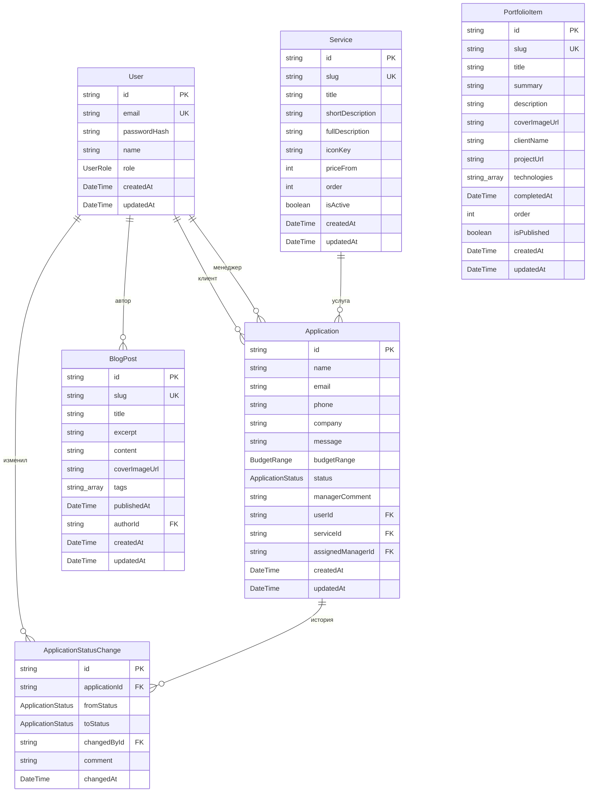

# ER-диаграмма базы данных

Источник истины — `prisma/schema.prisma`. Диаграмма в формате Mermaid отображается на GitHub автоматически.

## Состав сущностей

| Сущность | Назначение |
|---|---|
| **User** | Пользователь системы (клиент, менеджер, администратор). Уникальный email, хеш пароля, роль. |
| **Service** | Услуга в каталоге веб-представительства. Уникальный slug, заголовок, краткое и полное описание, опциональная цена «от X», порядок отображения, признак активности. |
| **Application** | Клиентская заявка. Может быть отправлена анонимно (`userId = null`) или из личного кабинета. Привязка к конкретной услуге опциональна. Поле `status` — текущий статус, `statusHistory` — полная история смены. |
| **ApplicationStatusChange** | Запись истории смены статуса заявки. Фиксирует, кто и когда изменил статус, с каким комментарием. |
| **PortfolioItem** | Кейс портфолио. Содержит описание реализованного проекта, технологии, ссылку на проект (опционально). |
| **BlogPost** | Публикация блога. Markdown-контент, теги, дата публикации (null = черновик), автор. |

## Перечисления

- **UserRole** — `CLIENT`, `MANAGER`, `ADMIN`.
- **ApplicationStatus** — `NEW`, `IN_PROGRESS`, `DONE`, `REJECTED`. Жизненный цикл: `NEW → IN_PROGRESS → {DONE, REJECTED}`.
- **BudgetRange** — `UNDER_100K`, `FROM_100K_TO_500K`, `FROM_500K_TO_1M`, `OVER_1M`.

## Связи

| Связь | Тип | Поведение при удалении |
|---|---|---|
| `User` → `Application` (клиент) | 1 : N | `SetNull` (заявка остаётся как анонимная) |
| `User` → `Application` (менеджер) | 1 : N | `SetNull` (заявка остаётся без назначенного менеджера) |
| `User` → `ApplicationStatusChange` (изменил) | 1 : N | `Restrict` (нельзя удалить пользователя с историей изменений) |
| `User` → `BlogPost` (автор) | 1 : N | `Restrict` (нельзя удалить автора публикации) |
| `Service` → `Application` | 1 : N | `SetNull` (заявка переживает удаление услуги) |
| `Application` → `ApplicationStatusChange` | 1 : N | `Cascade` (история удаляется вместе с заявкой) |

## Диаграмма

## Индексы

| Таблица | Индекс | Назначение |
|---|---|---|
| `User` | `(role)` | Быстрый отбор пользователей по роли (для админки) |
| `Service` | `(isActive, order)` | Сортированный список активных услуг для каталога |
| `Application` | `(status, createdAt)` | Сортированный список заявок по статусу для админки |
| `Application` | `(userId)` | Заявки конкретного клиента в его кабинете |
| `Application` | `(assignedManagerId)` | Заявки конкретного менеджера |
| `ApplicationStatusChange` | `(applicationId, changedAt)` | История заявки в хронологическом порядке |
| `PortfolioItem` | `(isPublished, order)` | Сортированный список опубликованных кейсов |
| `BlogPost` | `(publishedAt)` | Сортировка по дате публикации |
| `BlogPost` | `(authorId)` | Список публикаций автора |
